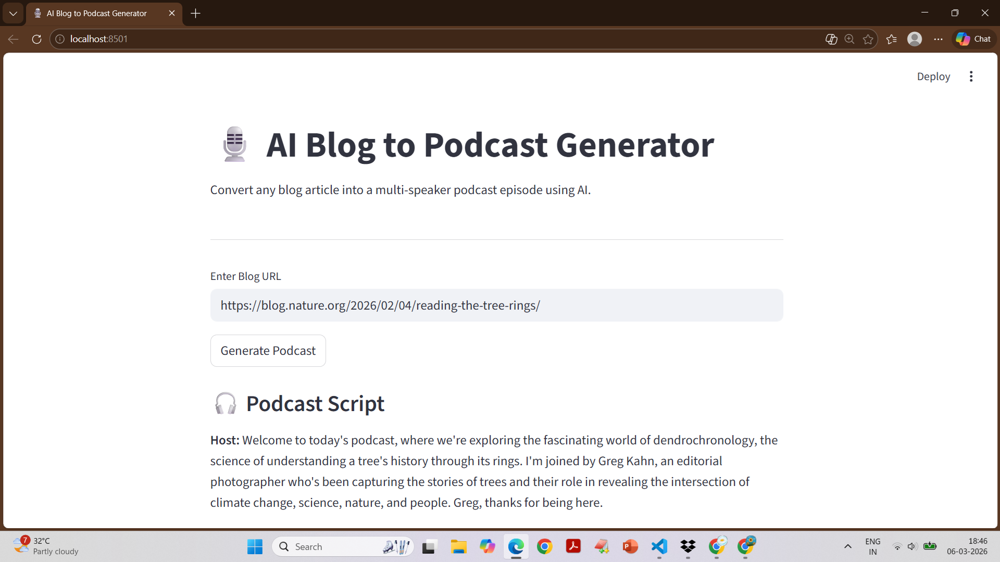
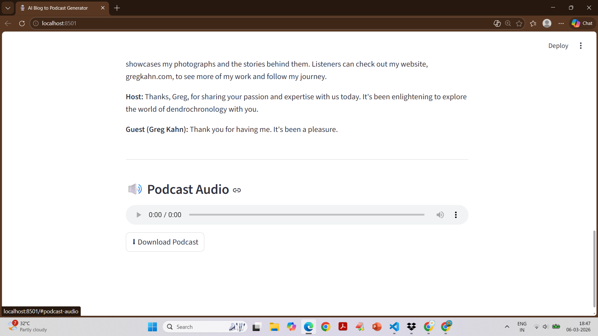

# AI Blog to Podcast Generator 🎙️

An AI-powered application that converts blog articles into podcast-style audio episodes.
Simply paste a blog URL and the app will generate a conversational podcast script and audio narration.

## 🚀 Features

* Extracts blog content automatically from a URL
* Generates a podcast-style script using an AI LLM
* Supports **multi-speaker conversation (Host + Guest)**
* Converts the script into **realistic voice audio**
* Play the podcast directly in the browser
* Download the generated podcast as an audio file

## 🛠 Tech Stack

* **Streamlit** – Web interface
* **Firecrawl** – Web scraping
* **Groq LLM (Llama 3)** – Script generation
* **ElevenLabs** – Text-to-Speech audio generation
* **Python** – Backend logic

## ⚙️ Installation

Clone the repository:

```
git clone https://github.com/yourusername/ai-blog-to-podcast-generator.git
```

Navigate to the project folder:

```
cd ai-blog-to-podcast-generator
```

Install dependencies:

```
pip install -r requirements.txt
```

Create a `.env` file and add your API keys:

```
FIRECRAWL_API_KEY=your_key
GROQ_API_KEY=your_key
ELEVENLABS_API_KEY=your_key
```

Run the application:

```
streamlit run blog_to_podcast_agent.py
```

## 🎧 How It Works

1. User enters a blog URL
2. Firecrawl extracts the blog content
3. Groq LLM converts the blog into a **podcast conversation script**
4. ElevenLabs generates **AI voice narration**
5. Streamlit plays the generated podcast audio

## Screenshots



## 📂 Project Structure

```
ai-blog-to-podcast-generator
│
├── app.py
├── requirements.txt
├── README.md
├── .gitignore
│
└── assets
│   └── demo1.png
│   └── demo2.png
│
└── .env   (not uploaded to GitHub)
```

## 🔮 Future Improvements

* Support **YouTube videos → podcast**
* Convert **PDF documents,articlesv → podcast**
* Add **multiple voice styles**
* Export podcasts to **Spotify / RSS format**
* Improve conversation realism with AI agents

## 📜 License

This project is open-source and available for educational and personal use.


## 👨‍💻 Author

Developed as an AI project demonstrating:

* LLM prompt engineering
* API integration
* AI voice synthesis
* Streamlit app development
